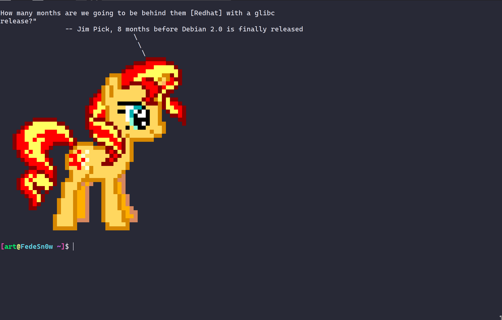

# ponysay-C
Had to rewrite ponysay from python to C so that it can generate as many ponies as quickly as possible 🎠🎠🎠🎠

So that each time you open a terminal instance, you can have a pony.
Example: Start your terminals with
```
fortune -s | ponysay-c
```
and get this:


